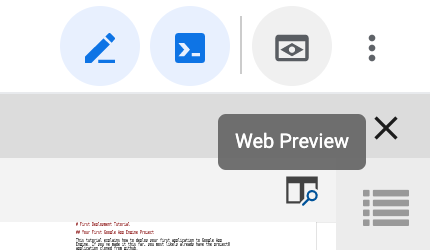

# First Deployment Tutorial

## Your First Google App Engine Project

This tutorial explains how to deploy your first application to Google App 
Engine. If you've made it this far, you most likely already have the project0
application cloned from github.

## Installing Flask

You'll want to start by installing Flask.

```bash
pip3 install Flask==1.1.1
```

Once you've got Flask installed, you can easily test your first application 
by running the following command. Make sure you're in your project0 folder, 
and try running this command.

```bash
python3 main.py
```

Your application can be tested by using the web preview; there's a button to 
open it in the top-right corner of your screen.




## Deploying Your Application

If you haven't created a project yet, you can do that from the command line.

To create your project, enter the command below, but following "gcloud projects
create" you need to enter a project ID. It will need to be unique for all of
App Engine.

```bash
gcloud projects create 
```

If you _have_ created a project, you'll need to set it using the gcloud 
command - but enter _your_ project ID following the "gcloud config set project" text:

```bash
gcloud config set project
```

Once you've done this, you can deploy easily:

```bash
gcloud app deploy
```

Note that we have to tell Google App Engine that we are using Flask; we do this
with the requirements.txt file.  You can see what it looks like with this
command:

```bash
edit requirements.txt
```

In the future, we'll be able to tell pip to install using the same format with
the -r flag.

```bash
pip3 install -r requirements.txt
```


## Viewing your live application

Now you can find your application by navigating to the following URL in your 
browser: 

```
http://YOUR-APPLICATION-ID.appspot.com/ 
```

You can also enter the command below to view your live application:

```bash
gcloud app browse
```